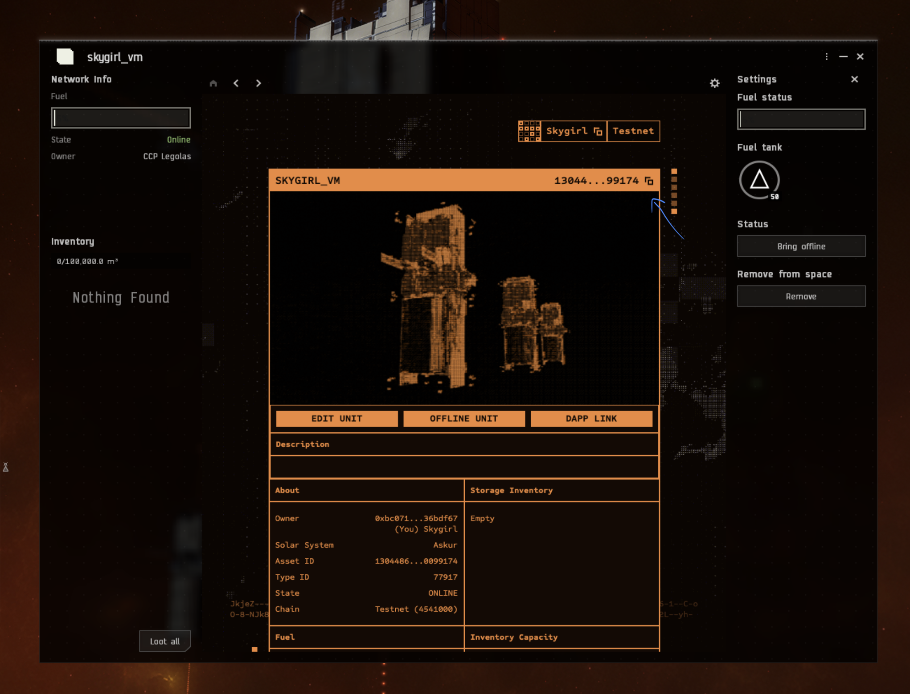

# Gate Keeper Example

## Introduction
This guide will walk you through the process of building contracts for the gate keeper, deploying them into an existing world running in Docker, and testing their functionality by executing scripts.

The gate keeper allows you to crowdfund items toward a specific goal. For example, if you need a certain amount of resources to build a new ship for the corporation etc. Previously, in the game gate keeper was used to have shared goals for players to contribute salt. Once the goals were met, gates and new areas were unlocked.

### Additional Information

For additional information on the Smart Storage Unit you can visit: [https://docs.evefrontier.com/SmartAssemblies/SmartStorageUnit](https://docs.evefrontier.com/SmartAssemblies/SmartStorageUnit).

## Deployment and Testing
### Step 0: Deploy the gate keeper contracts to the existing world
First, copy the World Contract Address from the Docker logs obtained in the previous step, then run the following command:


```bash
cd gate-keeper/packages/contracts
```

Install the dependencies for the contracts:
```bash
pnpm install
```

**Local Deployment**
This will deploy the contracts to your local world.
```bash
pnpm deploy:local --worldAddress <worldAddress> 
```

**Devnet/Production Deployment**
To deploy in devenet or production you can retrieve the world address through the below links and then replace <worldAddress> with the world address. 

Devnet which connects to Nova - Builder Sandbox

https://blockchain-gateway-nova.nursery.reitnorf.com/config

```bash
pnpm run deploy:garnet --worldAddress <worldAddress> 
```

Production which connects to Nebula

https://blockchain-gateway-nebula.nursery.reitnorf.com/config 

eg: `pnpm deploy:garnet --worldAddress 0xafc8e4fd5eee66590c93feebf526e1aa2e93c6c3`

Once deployment is successful, you'll see a screen similar to the one below. This process deploys the Gate Keeper contract. <br>


### Step 1: Setup the environment variables 
Next, replace the following values in the [.env](./packages/contracts/.env) file with the respective values 

You can change values in the .env file for Nova and Nebula, though they are optional for local testing.

For Nova and Nebula, Get your recovery phrase from the game wallet, import into EVE Wallet and then grab the private key from there.

```bash
PLAYER_PRIVATE_KEY=0xac0974bec39a17e36ba4a6b4d238ff944bacb478cbed5efcae784d7bf4f2ff80
```

For Nova and Nebula, get the world address from the configs

https://blockchain-gateway-nova.nursery.reitnorf.com/config
https://blockchain-gateway-nebula.nursery.reitnorf.com/config


```bash
#WORLD ADDRESS COPIED FROM DOCKER LOGS FOR LOCAL
WORLD_ADDRESS=
```
For Nova or Nebula, Smart Storage Unit ID (SSU ID) is available once you have deployed an SSU in the game.

Right click your Smart Storage Unit, and open the dapp window and copy the smart storage unit id.



```bash
#DONT NEED TO CHANGE IF YOUR RUNNING LOCALLY
SSU_ID=34818344039668088032259299209624217066809194721387714788472158182502870248994
```

For Nova or Nebula, the Inventory item id can be copied from the world api by using the below links and replace the `ssu_id` by your own SSU_ID.

https://blockchain-gateway-nebula.nursery.reitnorf.com/smartassemblies/<ssu_id>
https://blockchain-gateway-nova.nursery.reitnorf.com/smartassemblies/<ssu_id>

Fetch the `itemId` from `{inventory.storageItems.itemId}`


```bash
#Item for the goal
INVENTORY_ITEM_ID=112603025077760770783264636189502217226733230421932850697496331082050661822826
#Quantity needed to reach the goal
TARGET_QUANTITY=10
```

</details>

### Step 2: Mock data for the existing world **(Local Development Only)**
To generate mock data for testing the Gate Keeper logic on the local world, run the following command:

```bash
pnpm mock-data
```
This will create the on-chain SSU, fuel it and bring it online. This SSU will then act as a gate keeper, which has to be online to receive items for the set goal. 

### Step 3: Configure Gate Keeper 
To configure which items should be received and the target amount, run:

```bash
pnpm configure-gate-keeper
```

You can adjust the values for the SSU_ID, INVENTORY_ITEM_ID & TARGET_QUANTITY in the .env file as needed, though they are optional.

### Step 4: Test Gate Keeper (Optional)
To test the gate keeper, execute the following command:

```bash
pnpm deposit-to-ssu
```

### Troubleshooting

If you encounter any issues, refer to the troubleshooting tips below:

1. **World Address Mismatch**: Double-check that the `WORLD_ADDRESS` is correctly updated in the `contracts/.env` file. Make sure you are deploying contracts to the correct world.
   
2. **Anvil Instance Conflicts**: Ensure there is only one running instance of Anvil. The active instance should be initiated via the `docker compose up -d` command. Multiple instances of Anvil may cause unexpected behavior or deployment errors.

3. **Item Limits**: Be cautious not to attempt depositing more items than have been generated via the `mock-data` script. The number of available items is controlled by `MockSsuData.s.sol`, so ensure this script has been properly executed. The default number generated is 15, however you can change this as needed.

### Still having issues?
If you are still having issues, then visit [the documentation website](https://docs.evefrontier.com/Troubleshooting) for more general troubleshooting tips.