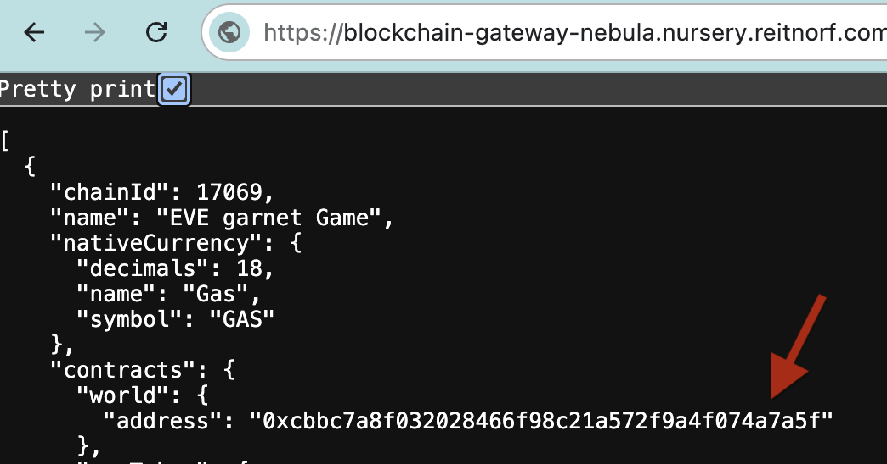

# Smart Gate Example

## Introduction
This guide will walk you through the process of building contracts for the Smart Gate, deploying them into an existing world running in Docker, and testing their functionality by executing scripts.

This example shows how to interact with the Smart gate smart assembly and how to create contracts for it. The Smart Gate allows players to create player made transport gates, connecting systems and regions. It also features configuration options to allow specific players to use it.

### Additional Information

For additional information on the Smart Gate you can visit: [https://docs.evefrontier.com/SmartAssemblies/SmartGate](https://docs.evefrontier.com/SmartAssemblies/SmartGate).

## Deployment and Testing
### Step 0: Deploy the smart gate contracts to the existing world 
First, copy the World Contract Address from the Docker logs obtained in the previous step, then run the following command:


```bash
cd smart-gate/packages/contracts
```

Install the Solidity dependencies for the contracts:
```bash
pnpm install
```

**Local Deployment**
This will deploy the contracts to your local world.
```bash
pnpm deploy:local --worldAddress <worldAddress> 
```

**Devnet/Production Deployment**
To deploy in devenet or production you can retrieve the world address through the below links and then replace <worldAddress> with the world address. 

Devnet which connects to Nova - Builder Sandbox

https://blockchain-gateway-nova.nursery.reitnorf.com/config

```bash
pnpm run deploy:garnet --worldAddress <worldAddress> 
```

Production which connects to Nebula

https://blockchain-gateway-nebula.nursery.reitnorf.com/config 

eg: `pnpm deploy:garnet --worldAddress 0xafc8e4fd5eee66590c93feebf526e1aa2e93c6c3`

Once deployment is successful, you'll see a screen similar to the one below. This process deploys the Smart Gate contract. <br>


### Step 1: Setup the environment variables 
Next, replace the following values in the [.env](./packages/contracts/.env) file with the respective values 

You can change values in the .env file for Nova and Nebula, though they are optional for local testing.

For Nova and Nebula, Get your recovery phrase from the game wallet, import into EVE Wallet and then grab the private key from there.

```bash
PLAYER_PRIVATE_KEY=0xac0974bec39a17e36ba4a6b4d238ff944bacb478cbed5efcae784d7bf4f2ff80
```

For Nova and Nebula, get the world address from the configs

https://blockchain-gateway-nova.nursery.reitnorf.com/config
https://blockchain-gateway-nebula.nursery.reitnorf.com/config



```bash
#WORLD ADDRESS COPIED FROM DOCKER LOGS FOR LOCAL
WORLD_ADDRESS=
```
For Nova or Nebula, the smart gate id is available once you have deployed an Smart Gate in the game. 

Right click your Smart Gate, click Interact and open the dapp window and copy the smart gate id.

```bash
# Copy this info from in game smart gate
SOURCE_GATE_ID=34818344039668088032259299209624217066809194721387714788472158182502870248994

# Copy this info from in game smart gate
DESTINATION_GATE_ID=67387866010353549996346280963079126762450299713900890730943797543376801696007
```

### Step 2: Mock data for the existing world **(Local Development Only)**
To generate mock data for testing the Smart Gate logic on the local world, run the following command:

```bash
pnpm mock-data
```

This will create the on-chain Gates, fuel them, bring them online, and create a test smart character.

### Step 3: Configure Smart Gate
To configure which smart gates will be used, run:

```bash
pnpm configure-smart-gate
```

You can adjust the values for the SSU_ID, in and out item ID's and the ratios in the .env file as needed, though they are optional.

### Step 4: Link Gates
To use the smart gates, you need to link them together to create a connection. To link the source and destination gates use:

```bash copy
pnpm link-gates
```

### Step 5: Test The Smart Gate (Optional)
To test the smart gate and check the canJump, use the following command:

```bash
pnpm execute
```

### Troubleshooting

If you encounter any issues, refer to the troubleshooting tips below:

1. **World Address Mismatch**: Double-check that the `WORLD_ADDRESS` is correctly updated in the `contracts/.env` file. Make sure you are deploying contracts to the correct world.
   
2. **Anvil Instance Conflicts**: Ensure there is only one running instance of Anvil. The active instance should be initiated via the `docker compose up -d` command. Multiple instances of Anvil may cause unexpected behavior or deployment errors.

3. **Gate IDs Mismatch**: If you are using Garnet make sure you have set the SOURCE_GATE_ID and DESTINATION_GATE_ID correctly. 

4. **Not Linked**: Make sure you link the gates as seen in Step 4, as otherwise the Smart Gates will not work.

### Still having issues?
If you are still having issues, then visit [the documentation website](https://docs.evefrontier.com/Troubleshooting) for more general troubleshooting tips.